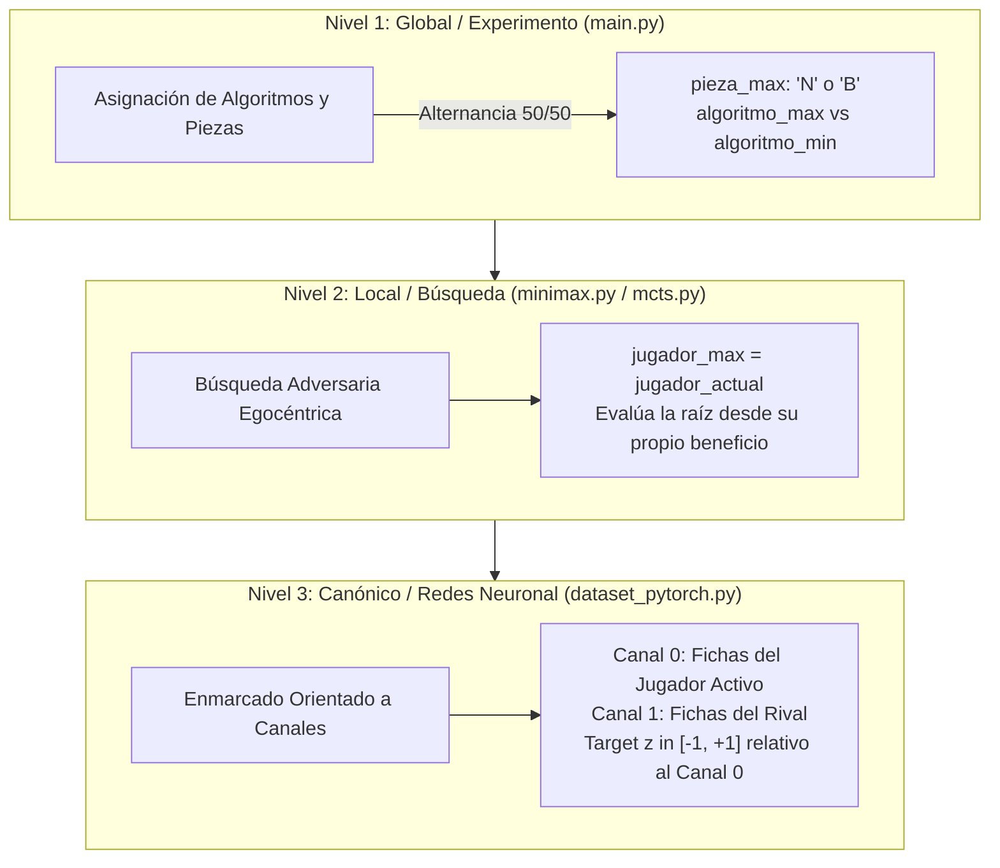

# GLOSARIO DE FUNCIONES, ARQUITECTURA Y CLARIFICACIÓN DE NOTACIÓN
**Trabajo de Fin de Grado en Matemáticas**
*Título:* Implementación, Evaluación Heurística y Aprendizaje Supervisado en Juegos de Suma Cero (Othello/Reversi)

---

## 1. INTRODUCCIÓN Y PROPÓSITO DEL DOCUMENTO

Este documento constituye una guía técnica y formal destinada a clarificar la estructura del código, las definiciones funcionales y los convenios de notación adoptados en el proyecto. 

En la formalización matemática de la Teoría de Juegos y los algoritmos de Búsqueda Adversaria (Minimax, Poda Alfa-Beta, MCTS), es habitual trabajar con conceptos abstractos como *jugador maximizador*, *jugador minimizador*, *perspectiva egocéntrica* y *enmarcado canónico*. En la práctica del software, la implementación de estos conceptos puede presentar aparentes ambigüedades si no se explicita el nivel de abstracción en el que opera cada módulo.

Este glosario resuelve detalladamente dichas dudas, prestando especial atención a la notación de los jugadores en la búsqueda y a los tres niveles jerárquicos de representación del juego.

---

## 2. CLARIFICACIÓN FUNDAMENTAL: ABUSOS DE NOTACIÓN Y CONVENIOS JERÁRQUICOS

### 2.1. El "Abuso de Notación" de `jugador_max` en Minimax

> [!IMPORTANT]
> **Concepto Clave**: En la literatura teórica clásica de Minimax, se suele fijar de forma absoluta que el Jugador 1 es MAX (quien busca maximizar la función de utilidad $U$) y el Jugador 2 es MIN (quien busca minimizar $U$).

En nuestra implementación (`minimax.py`), la firma de la función es:
```python
def minimax_universal(juego, estado, jugador_max, jugador_actual):
def minimax_alfa_beta(juego, estado, jugador_max, jugador_actual, profundidad, alfa, beta, heuristica):
```

#### ¿Por qué hablamos de un "Abuso de Notación"?
Cuando la máquina toma una decisión en su turno, la función `obtener_movimiento_maquina` (en `main.py`) invoca a Minimax pasando el argumento `jugador_max = jugador_actual`:
```python
puntaje, movimiento, nodos = minimax_universal(juego, estado, jugador, jugador)
```

**Significado Matemático y Algorítmico:**
1. **Perspectiva Egocéntrica (Negamax Equivalente)**: El parámetro `jugador_max` en `minimax.py` **NO** representa una máquina o tipo de ficha fijado globalmente (como "siempre las Negras" o "siempre la máquina de pesos"). Representa al **jugador evaluador activo** que está calculando su mejor jugada en ese instante.
2. **Formulación Dinámica del Árbol de Búsqueda**:
   - En la raíz del árbol de búsqueda, el jugador activo actúa como el maximizador de su propia función de utilidad esperada ($+1$ para su propia victoria, $-1$ para su derrota).
   - Su oponente (`rival = juego.obtener_rival(jugador_actual)`) actúa dentro del árbol como el minimizador de dicha utilidad.
3. **Conclusión**: `jugador_max` es un abuso de notación pedagógico y práctico para indicar *"el jugador desde cuya perspectiva se está evaluando la utilidad del árbol"*. En cada turno de la partida, el jugador al que le toca mover asume temporalmente el rol de `jugador_max`.

---

### 2.2. La Jerarquía de Etiquetado en 3 Niveles

Para evitar confusiones entre la simulación experimental de partidas, el cálculo local de la búsqueda adversaria y la representación en tensores para Redes Neuronal, el sistema opera bajo una jerarquía estricta de 3 niveles:



#### 1. Nivel 1: Global / Experimento (`main.py` y `benchmark_clasico.py`)
- **Variables**: `algoritmo_max`, `algoritmo_min`, `pieza_max`, `pieza_min`.
- **Propósito**: Define el experimento entre dos agentes configurados (ejemplo: Minimax Pesos Posicionales vs. Minimax Movilidad).
- **Invariante de Imparcialidad**: En datasets y torneos estadísticos, las piezas (`'N'` o `'B'`) se alternan 50% de las partidas para cada algoritmo, anulando el sesgo telemático del primer jugador.

#### 2. Nivel 2: Local / Búsqueda (`minimax.py`, `mcts.py`)
- **Variables**: `jugador_max`, `jugador_actual`, `nodo.jugador_actual`.
- **Propósito**: Ejecutar el algoritmo de decisión en el estado presente.
- **Funcionamiento**: Independientemente de si el agente global asignado es la máquina "MAX" o "MIN", al calcular la jugada, pasa su propio identificador de pieza como `jugador_max`.

#### 3. Nivel 3: Canónico / Redes Neuronal (`dataset_pytorch.py`, `mcts.py`)
- **Variables**: `tensor_estado` de dimensión $(2, N, N)$, `Canal 0`, `Canal 1`, `target` ($z \in [-1.0, 1.0]$).
- **Propósito**: Normalización invariante a la pieza.
- **Invariante Canónico**:
  - **Canal 0**: Matriz binaria con $1.0$ en las fichas del jugador al que le toca mover (`Turno_Actual`).
  - **Canal 1**: Matriz binaria con $1.0$ en las fichas del oponente.
  - **Target ($z$)**: Recompensa desde el punto de vista del Canal 0. Si el CSV registra $Ganador\_Final = +1$ respecto a la máquina MAX de pesos, pero la fila corresponde a un turno de la máquina MIN de movilidad, el dataset ajusta $target\_val = -Ganador\_Final$ para garantizar que $+1.0$ siempre signifique victoria para el jugador del Canal 0.

---

## 3. GLOSARIO DETALLADO DE MÓDULOS Y FUNCIONES

### 3.1. Módulo `juegos.py` (Arquitectura POO y Reglas del Juego)

Este módulo define la abstracción orientada a objetos para juegos de tablero deterministas, de información perfecta y de suma cero.

#### `class Juego(ABC)`
Clase base abstracta que impone la interfaz formal para cualquier juego de suma cero.

- **`estado_inicial(self)`**
  - *Retorno*: `tuple(tablero, jugador_inicial)`
  - *Descripción*: Crea y devuelve la configuración inicial del tablero y asigna el primer turno (en Othello, 4 fichas centrales y turno para `'N'`).
- **`obtener_movimientos_legales(self, estado, jugador)`**
  - *Parámetros*: `estado` (list[list[str]]), `jugador` (str: `'N'` o `'B'`).
  - *Retorno*: `list[tuple(int, int)]` o `[None]`.
  - *Descripción*: Calcula las casillas vacías donde el jugador puede realizar una jugada válida según las reglas del juego. En Othello, si no existen jugadas válidas pero el juego no ha terminado, devuelve `[None]` para representar la acción de pasar turno.
- **`hacer_movimiento(self, estado, movimiento, jugador)`**
  - *Parámetros*: `estado`, `movimiento` (`(f, c)` o `None`), `jugador`.
  - *Retorno*: `nuevo_estado` (list[list[str]]).
  - *Descripción*: Aplica una acción generando una copia profunda (`copy.deepcopy`) del tablero sin mutar el estado original. En Othello, flanquea y voltea las fichas oponentes encerradas.
- **`es_terminal(self, estado)`**
  - *Parámetros*: `estado`.
  - *Retorno*: `bool`.
  - *Descripción*: Determina si la partida ha finalizado. En Othello, el estado es terminal si ambos jugadores se ven obligados a pasar consecutivamente (`movs_n == [None]` y `movs_b == [None]`) o el tablero está lleno.
- **`obtener_rival(self, jugador)`**
  - *Parámetros*: `jugador` (`'N'`, `'B'`, `'X'`, `'O'`).
  - *Retorno*: `str`.
  - *Descripción*: Devuelve el identificador de la pieza contraria (ej. `'B'` si recibe `'N'`).
- **`obtener_utilidad(self, estado, jugador)`**
  - *Parámetros*: `estado`, `jugador`.
  - *Retorno*: `int` ($+1$, $-1$, o $0$).
  - *Descripción*: Función de utilidad final del juego de suma cero. Devuelve $+1$ si el `jugador` gana por recuento de fichas, $-1$ si pierde y $0$ si hay empate.
- **`evaluar_estado(self, estado, jugador, heuristica=None)`**
  - *Parámetros*: `estado`, `jugador`, `heuristica` (`"pesos"`, `"movilidad"`, `"hibrida"`).
  - *Retorno*: `float` / `int`.
  - *Descripción*: Función de evaluación heurística para estados no terminales en Minimax acotado:
    - `"pesos"`: Suma ponderada de la matriz estática de valores posicionales $8 \times 8$ (esquinas $+100$, casillas C/X $-20$/$-50$).
    - `"movilidad"`: $(\text{movs\_legales\_jugador} - \text{movs\_legales\_rival}) \times 10$.
    - `"hibrida"`: Combinación lineal $\text{Pesos\_Posicionales} + 10 \times \text{Movilidad\_Relativa}$.

---

### 3.2. Módulo `minimax.py` (Búsqueda Adversaria Clásica)

Módulo encargado del cálculo del valor Minimax exacto y acotado con poda.

- **`minimax_universal(juego, estado, jugador_max, jugador_actual)`**
  - *Firma*: `(juego, estado, jugador_max, jugador_actual)`
  - *Retorno*: `tuple(mejor_puntaje, mejor_movimiento, total_nodos_evaluados)`
  - *Descripción*: Algoritmo Minimax completo sin poda ni límite de profundidad (usado en Tres en Raya y Othello $4 \times 4$). Explora de forma exhaustiva todo el árbol del juego. Devuelve la utilidad exacta del nodo y el contador de nodos visitados.
- **`minimax_alfa_beta(juego, estado, jugador_max, jugador_actual, profundidad, alfa, beta, heuristica)`**
  - *Firma*: `(juego, estado, jugador_max, jugador_actual, profundidad, alfa=-inf, beta=+inf, heuristica=None)`
  - *Retorno*: `tuple(mejor_puntaje, mejor_movimiento, total_nodos_evaluados)`
  - *Descripción*: Algoritmo Minimax optimizado con Poda Alfa-Beta y límite de profundidad $d$. Mantiene la ventana $[\alpha, \beta]$ donde $\alpha$ representa la mejor opción asegurada para el jugador maximizador hasta el momento, y $\beta$ la mejor opción para el minimizador. Cuando $\beta \le \alpha$, se podan las ramas restantes. Al alcanzar `profundidad == 0`, invoca `juego.evaluar_estado`.

---

### 3.3. Módulo `mcts.py` (Monte Carlo Tree Search Clásico y Neuronal)

Contiene la implementación de la estructura de datos del árbol MCTS y las dos clases examinadas en la memoria (MCTS basado en Rollouts Aleatorios vs MCTS Guiado por Red Neuronal CNN).

#### `class NodoMCTS`
- **`__init__(self, estado, jugador_actual, movimiento_origen=None, padre=None, juego=None)`**: Instancia un nodo guardando el contador de visitas $N$, valor acumulado $W$, valor promedio $Q = W/N$, lista de movimientos no probados e hijos expandidos.
- **`esta_totalmente_expandido(self)`**: Devuelve `True` si no restan jugadas legales por probar desde este nodo.
- **`ucb1(self, c_param=1.414)`**:
  - *Fórmula*: 
    $$UCB1 = Q_i + c \sqrt{\frac{\ln N_{\text{padre}}}{N_i}}$$
  - *Descripción*: Equilibrador entre Explotación ($Q_i$) y Exploración. Ajusta la inversión de signo de $Q_i$ cuando cambia el turno entre padre e hijo para evaluar la conveniencia desde la perspectiva del nodo padre.

#### `class MCTSClasico`
- **`rollout(self, estado_inicial, jugador_inicial)`**: Ejecuta una simulación montecarlo aleatoria completa desde el estado hasta el fin de la partida y devuelve la utilidad final ($\pm 1$).
- **`simular_busqueda(self, raiz)`**: Realiza una iteración completa con las 4 fases de MCTS: **Selección** (vía UCB1), **Expansión** (creación del nodo hijo), **Evaluación** (mediante rollout aleatorio) y **Retropropagación** (actualización de $N$ y $W$ ascendiendo hasta la raíz).
- **`mejor_movimiento(self, estado, jugador, num_simulaciones=50)`**: Ejecuta el bucle de $N$ simulaciones y selecciona la acción correspondiente al hijo más visitado (criterio robusto).

#### `class MCTSNeuronal`
- **`estado_a_tensor(self, estado, jugador)`**: Convierte la matriz 2D del tablero a un tensor de PyTorch de dimensión $(1, 2, N, N)$ con enmarcado canónico (Canal 0: jugador activo, Canal 1: rival).
- **`simular_busqueda(self, raiz)`**: Sustituye la fase de rollout costosa y ruidosa por la **inferencia directa** en la Red de Valor Convolutional (`RedDeValorCNN`), obteniendo un valor predicho $v \in [-1, 1]$ en tiempo $O(1)$.
- **`mejor_movimiento(self, estado, jugador, num_simulaciones=50)`**: Retorna la jugada más visitada tras $N$ evaluaciones neuronales.

---

### 3.4. Módulo `dataset_pytorch.py` (Procesamiento y Datasets)

Módulo encargado de la ingesta de archivos CSV generados por `main.py` y su transformación a estructuras de datos nativas de PyTorch.

#### `class OthelloDataset(Dataset)`
- **`__init__(self, ruta_csv, transform=None)`**: Carga el DataFrame con pandas y valida las columnas necesarias (`Tablero`, `Turno_Actual`, `Ganador_Final`, `Algoritmo`).
- **`__len__(self)`**: Devuelve la cantidad total de muestras en el CSV.
- **`__getitem__(self, idx)`**:
  1. Extrae la cadena binaria del tablero (longitud 64 para $8 \times 8$).
  2. Genera los canales espaciales $2 \times N \times N$.
  3. Realiza la conversión canónica de la etiqueta: si la fila proviene de la ejecución de la máquina MIN (ej. `"alfa_beta_movilidad"`), aplica $target\_val = -Ganador\_Final$, garantizando que el objetivo siempre se refiera a la victoria del Canal 0.
  4. Devuelve `(tensor_estado, target)`.

#### `obtener_dataloaders(ruta_o_dataset, batch_size=64, train_ratio=0.8, shuffle=True, seed=42, num_workers=0)`
- Divide el dataset en subconjuntos de Entrenamiento ($80\%$) y Validación ($20\%$) mediante `random_split` con semilla fija, devolviendo las instancias `DataLoader` listos para el entrenamiento en GPU/CPU.

---

### 3.5. Módulo `entrenamiento_supervisado.py` (Red Neuronal de Valor)

Contiene la definición de la arquitectura de red convolucional y el bucle de aprendizaje supervisado.

#### `class RedDeValorCNN(nn.Module)`
- **Arquitectura**:
  1. `Conv1`: $2 \to 32$ filtros, kernel $3 \times 3$, padding 1 + `BatchNorm2d` + `ReLU`.
  2. `Conv2`: $32 \to 64$ filtros, kernel $3 \times 3$, padding 1 + `BatchNorm2d` + `ReLU`.
  3. `Conv3`: $64 \to 128$ filtros, kernel $3 \times 3$, padding 1 + `BatchNorm2d` + `ReLU`.
  4. `FC1`: Capa densa $128 \times N \times N \to 128$ neuronas + `ReLU` + `Dropout(0.3)`.
  5. `FC2`: Capa densa $128 \to 1$ neurona con activación `Tanh` ($[-1, 1]$).
- **`forward(self, x)`**: Pasa el tensor de entrada $(B, 2, N, N)$ a través de la red y produce la valoración del tablero.

#### `entrenar_y_evaluar(...)`
- Ejecuta el bucle de épocas de entrenamiento utilizando la función de pérdida del Error Cuadrático Medio (`nn.MSELoss`) y el optimizador `AdamW`, guardando los pesos del modelo con menor pérdida en validación (`mejor_red_valor_8x8.pth`).

---

### 3.6. Módulo `main.py` (Controlador e Interfaz de Simulación)

Módulo principal que integra los algoritmos, gestiona la interfaz interactiva y automatiza la generación de partidas sintéticas.

- **`obtener_agente_mcts(juego)`**: Patrón Singleton que busca la ruta del archivo de pesos `.pth` entrenado e instancia una única vez la clase `MCTSNeuronal` para reutilizarla eficientemente durante la ejecución.
- **`imprimir_tablero(estado)`**: Imprime por consola la representación gráfica en texto del tablero con coordenadas numeradas.
- **`pedir_movimiento(movimientos_validos)`**: Gestiona la entrada por teclado para jugadores humanos, validando límites y formatos.
- **`seleccionar_algoritmo(nombre_maquina, juego)`**: Menú interactivo para configurar los tipos de agente (Minimax Universal, Poda Alfa-Beta con heurísticas, Aleatorio, MCTS Neuronal).
- **`obtener_movimiento_maquina(juego, estado, jugador, algoritmo, silencioso, numero_turno, turnos_aleatorios_inicio, epsilon)`**:
  - *Función*: Despacha la decisión al motor seleccionado.
  - *Mecanismo de Diversificación*: Durante los primeros $N$ turnos (`turnos_aleatorios_inicio`), elige una jugada aleatoria para asegurar variedad temática en las partidas. Posteriormente, aplica una política $\epsilon$-greedy (probabilidad $\epsilon$ de acción aleatoria) antes de recurrir a la búsqueda determinista.

---

### 3.7. Módulo `benchmark_clasico.py` (Evaluación Experimental y Torneos)

Módulo diseñado para la comparación empírica rigurosa de rendimientos entre los distintos agentes.

#### `class AgenteBenchmark`
Clase contenedora que acumula estadísticas de desempeño: `partidas_jugadas`, `victorias`, `empates`, `derrotas`, `tiempo_total_calculo`, `nodos_totales_evaluados`, `turnos_totales_jugados`.
- **Propiedades calculadas**:
  - `porcentaje_victorias`: $(\text{victorias} / \text{partidas}) \times 100$.
  - `porcentaje_puntos_efectivos`: Puntuación estándar de ajedrez $(\text{victorias} + 0.5 \times \text{empates}) / \text{partidas} \times 100$.
  - `tiempo_medio_turno`: Tiempo de cómputo promedio por decisión en segundos.
  - `nodos_medio_turno`: Nodos o simulaciones evaluadas por turno.

#### `jugar_partida_benchmark(juego, agente_n, agente_b, turnos_aleatorios_inicio, epsilon)`
Ejecuta una partida completa entre dos instancias de `AgenteBenchmark`, alternando turnos y registrando el tiempo consumido y los nodos evaluados en cada movimiento, devolviendo el resultado final y las métricas acumuladas.

---

## 4. CUADRO RESUMEN Y REFERENCIA RÁPIDA DE SÍMBOLOS

| Función / Clase | Módulo | Entradas Principales | Salida / Retorno | Significado Teórico / Rol |
| :--- | :--- | :--- | :--- | :--- |
| `obtener_utilidad` | `juegos.py` | `estado, jugador` | $+1, -1, 0$ | Función de recompensa terminal del juego de suma cero. |
| `evaluar_estado` | `juegos.py` | `estado, jugador, heuristica` | `float` | Valoración heurística aproximada de estados no terminales. |
| `minimax_universal` | `minimax.py` | `juego, estado, jug_max, jug_act` | `(val, mov, nodos)` | Valor Minimax exacto por exploración exhaustiva. |
| `minimax_alfa_beta` | `minimax.py` | `..., prof, alfa, beta, heur` | `(val, mov, nodos)` | Búsqueda acotada con poda de ramas subóptimas ($\beta \le \alpha$). |
| `ucb1` | `mcts.py` | `c_param` | `float` | Límite superior de confianza para balancear exploración/explotación. |
| `estado_a_tensor` | `mcts.py` / `dataset_pytorch.py` | `estado, jugador` | Tensor $(2, N, N)$ | Enmarcado canónico (Canal 0: jugador activo, Canal 1: rival). |
| `OthelloDataset` | `dataset_pytorch.py` | `ruta_csv` | `(tensor, target)` | Dataset PyTorch con simetría canónica ajustada en las etiquetas. |
| `RedDeValorCNN` | `entrenamiento_supervisado.py` | Tensor $(B, 2, N, N)$ | Valor $v \in [-1, 1]$ | Función de evaluación aproximada mediante Red Convolucional. |
| `obtener_movimiento_maquina` | `main.py` | `juego, estado, jugador, alg` | `(mov, tiempo, nodos)` | Controlador general de decisión con política $\epsilon$-greedy. |
| `AgenteBenchmark` | `benchmark_clasico.py` | `nombre, id_algoritmo` | Objeto Métricas | Acumulador de métricas estadísticas para evaluación experimental. |

---

> [!NOTE]
> Este glosario está diseñado para ser consultado junto con los artefactos de la memoria y el código fuente. Garantiza la trazabilidad entre las ecuaciones matemáticas del texto explicativo del TFG y las líneas de código implementadas.
