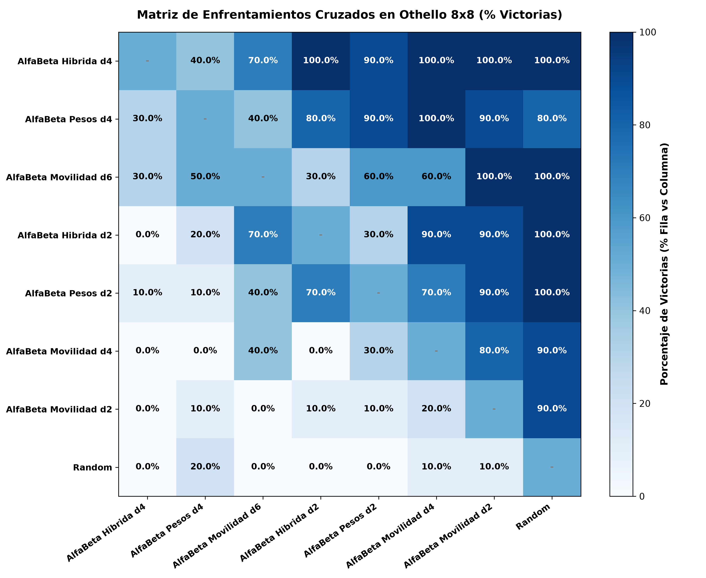
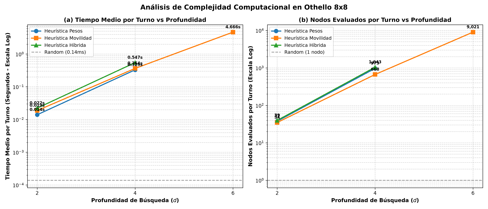

# Teoría de Juegos y Aprendizaje por Refuerzo en Juegos de Suma Cero: De Minimax Clásico a AlphaZero

[](https://www.python.org/)
[](https://pytorch.org/)
[](LICENSE)
[](https://huggingface.co/)

> **Trabajo de Fin de Grado en Matemáticas**  
> *Autor:* Álvaro León Ojeda  


---

## 📌 Descripción General

Este repositorio contiene la implementación completa, modular y reproducible del Trabajo de Fin de Grado (TFG) en Matemáticas **Introducción a la Inteligencia Artificial: Búsqueda con adversario y juegos**. 

El proyecto aborda desde la verificación del **Teorema de Zermelo** en juegos completamente resolubles (Tres en Raya) hasta el desarrollo y evaluación de motores de decisión autónomos para **Othello/Reversi ($8 \times 8$ y $4 \times 4$)**, comparando:
1. **Búsqueda Exhaustiva y Heurística Clásica**: Minimax Universal y Minimax con Poda Alfa-Beta ($\alpha$-$\beta$) acotada por profundidad con heurísticas posicionales, de movilidad e híbridas.
2. **Búsqueda en Árbol de Monte Carlo (MCTS)**: MCTS puro guiado por simulaciones (*rollouts*) y selección UCB1 (*Upper Confidence Bound for Trees*).
3. **MCTS Guiado por Red Neuronal (CNN)**: Reemplazo de los rollouts aleatorios por inferencia directa de una red de valor.
4. **Aprendizaje Autónomo Tabula Rasa**: Entrenamiento por auto-juego (*Self-Play*) con arquitectura dual (política y valor) y selección PUCT sin conocimiento previo humano.

---

## 🗂️ Estructura del Repositorio

```text
├── juegos.py                          # Jerarquía POO abstracta (Juego, TresEnRaya, Othello 8x8 y 4x4)
├── minimax.py                         # Algoritmos de Minimax Universal y Poda Alfa-Beta con heurísticas
├── mcts.py                            # Implementación de NodoMCTS, MCTS Clásico y MCTS Neuronal
├── dataset_pytorch.py                 # Transformación a tensores (2, N, N) y DataLoaders
├── entrenamiento_supervisado.py       # Arquitectura CNN RedDeValorCNN y bucle de entrenamiento en PyTorch
├── main.py                            # Interfaz CLI interactiva y generador estocástico de partidas
│
├── benchmark_othello_estadistico.py   # Torneo estadístico de 280 partidas (Capítulo 5) con matriz diagonalizada
├── benchmark_othello_clasico.py       # Torneo clásico determinista (Capítulo 5)
├── benchmark_global_cap6.py           # Torneo multiramas del Capítulo 6 (MCTS Neuronal vs Minimax vs Heurísticas)
├── tabula_rasa_4x4.py                 # Pipeline de auto-juego y aprendizaje Tabula Rasa en Othello 4x4
├── verificar_zermelo.py               # Comprobación del Teorema de Zermelo en Tres en Raya
├── verificar_zermelo_y_podas.py       # Comparativa de estados explorados y poda alfa-beta
│
├── GLOSARIO_FUNCIONES_Y_NOTACION.md   # Glosario de funciones
├── requirements.txt                   # Dependencias de Python necesarias
├── .gitignore                         # Exclusión de entornos virtuales, cachés y archivos pesados
├── LICENSE                            # Licencia abierta MIT
└── figuras/                           # Figuras de alta resolución (300 DPI) para la memoria
    ├── heatmap_othello_estadistico.png
    ├── complejidad_othello_estadistico.png
    ├── heatmap_global_8x8.png
    ├── curva_perdida_supervisada_8x8.png
    ├── curva_perdida_tabula_rasa_4x4.png
    └── comparativa_latencia_decision.png
```

---

## ⚙️ Instalación y Requisitos

Se recomienda utilizar un entorno virtual con **Python 3.10 o superior**:

```bash
# 1. Clonar el repositorio
git clone https://github.com/varokhian/tfg-alo.git
cd tfg-alo

# 2. Crear y activar entorno virtual
python -m venv .venv

# En Windows:
.venv\Scripts\activate
# En Linux / macOS:
source .venv/bin/activate

# 3. Instalar dependencias
pip install -r requirements.txt
```

---

## 🚀 Guía de Reproducción de Experimentos

### 1. Interfaz Interactiva de Juego
Permite jugar partidas humano vs. máquina o enfrentar a dos máquinas en tiempo real:
```bash
python main.py
```

### 2. Verificación del Teorema de Zermelo (Capítulo 5)
Explora exhaustivamente el árbol de Tres en Raya demostrando el valor minimax nulo ($v^* = 0$, empate forzado con juego óptimo) y la reducción exponencial de estados de la poda $\alpha$-$\beta$:
```bash
python verificar_zermelo.py
python verificar_zermelo_y_podas.py
```

### 3. Torneo Experimental Estadístico de Othello 8x8 (Capítulo 5)
Ejecuta el torneo completo de 280 partidas (8 agentes cruzados en 28 enfrentamientos de 10 partidas cada uno con alternancia estricta de color) y genera la **matriz de victorias cruzadas diagonalizada**:
```bash
python benchmark_othello_estadistico.py
```

### 4. Entrenamiento de la Red Convolucional de Valor (Capítulo 6)
Entrena la red de valor `RedDeValorCNN` sobre los tensores $(2, 8, 8)$:
```bash
python entrenamiento_supervisado.py
```

### 5. Torneo Global Comparativo Multiramas (Capítulo 6)
Evalúa el rendimiento empírico de MCTS Neuronal frente a las heurísticas clásicas y los motores Minimax $\alpha$-$\beta$:
```bash
python benchmark_global_cap6.py
```

### 6. Aprendizaje Autónomo Tabula Rasa (Othello 4x4)
Ejecuta el ciclo de auto-juego por refuerzo con selección PUCT y función de pérdida dual $\mathcal{L} = (z - v)^2 - \boldsymbol{\pi}^\top \log \mathbf{p} + c \|\theta\|^2$:
```bash
python tabula_rasa_4x4.py
```

---

## 📊 Principales Resultados Empíricos

### 1. Matriz de Enfrentamientos Cruzados Diagonalizada (Capítulo 5)
La matriz de victorias del torneo estadístico de Othello $8 \times 8$ (280 partidas) refleja la jerarquía de rendimiento de mayor a menor desempeño:



| Puesto | Agente / Configuración | Profundidad ($d$) | Winrate (%) | Score Efectivo (%) | Diferencial Fichas Medio |
| :---: | :--- | :---: | :---: | :---: | :---: |
| **1** | `AlfaBeta_Hibrida_d4` | $d=4$ | **85.7%** | **87.9%** | **+18.6** |
| **2** | `AlfaBeta_Pesos_d4` | $d=4$ | **72.9%** | **75.7%** | **+12.2** |
| **3** | `AlfaBeta_Movilidad_d6` | $d=6$ | **61.4%** | **62.1%** | **+8.8** |
| **4** | `AlfaBeta_Hibrida_d2` | $d=2$ | **57.1%** | **57.9%** | **+1.9** |
| **5** | `AlfaBeta_Pesos_d2` | $d=2$ | **55.7%** | **55.7%** | **+1.2** |
| **6** | `AlfaBeta_Movilidad_d4` | $d=4$ | **34.3%** | **35.0%** | **-6.5** |
| **7** | `AlfaBeta_Movilidad_d2` | $d=2$ | **20.0%** | **20.0%** | **-13.1** |
| **8** | `Random` | --- | **5.7%** | **5.7%** | **-23.1** |

### 2. Análisis de Complejidad Temporal y Nodos Explorados
La evaluación experimental corrobora el crecimiento exponencial del espacio de estados y la efectividad de la poda $\alpha$-$\beta$:



---

## Modelos y Datasets en Hugging Face

Los conjuntos de datos y los modelos entrenados en PyTorch se encuentran alojados en [**Hugging Face**](https://huggingface.co/datasets/varokhian/tfg-alo):

- 📦 **Dataset de Auto-juego de 6 Horas ($8 \times 8$)**: Partidas sintéticas con más de 20.000 estados serializados.
- 🏋️ **Pesos de la Red Convolucional de Valor (`mejor_red_valor_8x8.pth`)**: Checkpoint entrenado con mínima pérdida de validación MSE.
- 🤖 **Pesos del Agente Tabula Rasa (`tabula_rasa_4x4.pth`)**: Checkpoint convergente del agente autónomo en $4 \times 4$.

> Consulta el enlace para acceder a los archivos y al script de carga rápida `cargar_dataset_hf.py`.

---

## 📖 Clarificación de Notación y Código

En la implementación de búsqueda adversaria en `minimax.py`, se utiliza el convenio `jugador_max = jugador_actual` en cada turno (perspectiva equivalente a Negamax). Para consultar la explicación detallada de la jerarquía de etiquetado en 3 niveles (Nivel Global, Nivel de Búsqueda y Nivel Canónico de PyTorch), revisa el documento adjunto:
📄 **[GLOSARIO_FUNCIONES_Y_NOTACION.md](GLOSARIO_FUNCIONES_Y_NOTACION.md)**

---


